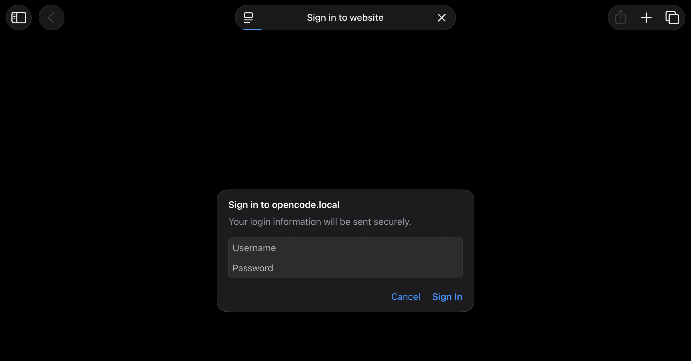

# opencode-ipad-relay

[](https://github.com/jk-esc/opencode-ipad-relay/actions/workflows/ci.yml)
[](https://github.com/jk-esc/opencode-ipad-relay/actions/workflows/security.yml)
[](LICENSE)

Secure, encrypted access to [`opencode web`](https://opencode.ai) from an iPad on
the same network — **HTTPS + mDNS + password, with zero third-party software**.
Only stock macOS tools (`python3`, `openssl`) are used.

## Why this project exists

`opencode web` serves a great mobile UI, but it speaks **plain HTTP only** — it
has no native TLS option. That has two nasty consequences on a shared network
(university, airport, coffee shop, coworking Wi-Fi):

- **Your password is sniffable.** `opencode web` supports HTTP Basic Auth, but
  over plain HTTP the credentials travel as cleartext base64. Anyone capturing
  traffic on the same LAN can read them.
- **mDNS is convenient but unencrypted.** Running `opencode web --mdns` gives
  you a nice stable name (`opencode.local`), but it also makes opencode listen
  on every interface (`0.0.0.0`), so the plain-HTTP server itself is exposed.

The usual workarounds each have an unacceptable cost for this use case:

| Alternative                             | Problem                                                      |
| --------------------------------------- | ------------------------------------------------------------ |
| Tailscale / VPN mesh                    | Requires installing an extra app on both devices             |
| ngrok / Cloudflare Tunnel               | Exposes a **public** URL to the internet                     |
| SSH tunnel                              | The iPad needs a third-party SSH client to browse through it |
| Commercial reverse proxy (nginx, Caddy) | Yet another thing to install                                 |

This project closes the gap with **nothing but what macOS already ships**: a
tiny stdlib-only Python TLS relay in front of `opencode web` (which is kept
on `127.0.0.1`), a self-signed certificate you trust once on the iPad, and
mDNS for discovery (advertised by the launcher with the stock `dns-sd` tool).
The result is real HTTPS, LAN-only, password-protected, no installs.

## Screenshots

<p align="center">
  
  
  
</p>

## Architecture

```
┌─────────────┐   HTTPS (TLS)    ┌──────────────────────┐   HTTP   ┌─────────────────────┐
│    iPad     │ ───────────────► │ Python TLS relay      │ ───────► │ opencode web        │
│  (trusts    │   https://       │ 0.0.0.0:443           │  127.0.0 │ 127.0.0.1:4096      │
│  cert once) │   opencode.local │ (self-signed cert)    │   1:4096 │ (bound to localhost)│
└─────────────┘                  └──────────────────────┘          └─────────────────────┘
        ▲                                ▲                                   ▲
        │  only reachable on the         │  single LAN-facing listener       │  started with
        │  same network (mDNS)           │  (terminates TLS)                  │  --hostname 127.0.0.1
```

The launcher advertises `opencode.local` itself (`dns-sd -P`, part of macOS)
because opencode only publishes mDNS for LAN-facing listeners, and we never
want one. Your Mac's own Bonjour name (`<name>.local`, printed at start-up)
works as a fallback.

The relay is a **raw TCP byte-pump**, not an HTTP proxy: the opencode web UI
depends on long-lived streams (Server-Sent Events on `/event`, WebSocket-style
sessions, keep-alive). An HTTP-level proxy strips the headers those need and
blocks on streams that never end — the page loads but the UI is dead. A
byte-level relay passes everything through untouched while still terminating
TLS, so the iPad<->Mac hop is fully encrypted.

## Requirements

- **Any Mac** — MacBook, iMac, Mac mini, Mac Studio — running a recent macOS.
  CI tests on macOS 15, both Intel and Apple Silicon.
- [`opencode`](https://opencode.ai) installed on that Mac (e.g. `brew install
opencode`); tested with 1.18.29, which has the `--hostname` flag the launcher
relies on. The relay itself adds nothing beyond what macOS ships.
- `python3` and `openssl` — stock on macOS. On a brand-new Mac, running
  `python3` for the first time may show an Apple dialog offering to install
  the Command Line Tools; accept it once and you're set.
- An iPad on the **same local network**.
- No third-party apps on the iPad, no tunnels, no accounts, no public exposure.

## Quickstart

```bash
git clone https://github.com/jk-esc/opencode-ipad-relay.git
cd opencode-ipad-relay
./install.sh
```

The installer will:

1. Verify the prerequisites.
2. Make up a password and show it to you once (stored only on your Mac,
   mode `600`). Run `./install.sh --password` if you'd rather choose your
   own; it asks for at least 12 characters.
3. Generate a self-signed certificate for `opencode.local` and your Mac's
   own Bonjour name, valid for 825 days (Apple's limit for a certificate
   iOS will trust).
4. Install `opencode-web` and `opencode-web-proxy.py` into `~/.local/bin`.
5. Print the one-time iPad trust steps.

Then, one time on the iPad: AirDrop `~/.local/share/opencode-web/cert.pem` to
it, install the profile, and enable full trust under
**Settings → General → About → Certificate Trust Settings**.

## Daily use

```bash
opencode-web
```

On the iPad (same network): `https://opencode.local` — log in with username
`opencode` and the password the installer gave you. It's lowercase letters
and digits in dash-separated groups, with no characters that look alike, so
it's bearable to type on a touch keyboard. Safari will offer to remember it.

The Mac's IP can change between networks; the launcher looks it up at every
start and advertises `opencode.local` for it. `caffeinate -i` in the launcher
prevents idle sleep while the server runs (closing the lid still sleeps the
Mac).

## What this protects, and from whom

Start with what you are handing out. `opencode web` can run shell commands
and edit files on your Mac. Anyone who reaches it with your password has,
for practical purposes, a terminal on your machine. Everything below exists
because of that one sentence.

**The attacker this is built for** is someone else on the same network: a
university or coworking Wi-Fi, a hotel, an airport. They can watch traffic,
connect to any port on your Mac, and claim any mDNS name they like.

What stops them:

- **Encryption.** TLS between iPad and Mac, so nothing on the Wi-Fi can read
  your session or your password. TLS 1.3 when your `python3` links an OpenSSL
  that has it; Apple's stock `python3` links LibreSSL 2.8.3 and negotiates
  1.2. Either way the relay only offers forward-secret AEAD ciphers, and it
  prints which library and protocol it got when it starts.
- **One door.** `opencode web` is started with `--hostname 127.0.0.1`, so the
  plain-HTTP backend isn't reachable from the network at all; the relay is
  the only LAN-facing listener. Check it yourself with
  `lsof -nP -iTCP -sTCP:LISTEN`.
- **A password worth having.** The installer generates one with 100 bits of
  entropy rather than letting you pick `hunter2`.
- **A cost per guess.** opencode itself has no rate limiting or lockout, so
  the relay adds some: a rejected login closes the connection, making every
  guess pay for a new TLS handshake, and twenty rejections from one address
  in ten minutes blocks it for fifteen.
- **A ceiling.** 64 connections at once, 16 from one address, 30 new per
  minute per address, a ten second handshake limit and a fifteen minute idle
  timeout. Connections over the limit are dropped before any TLS work.
- **A record.** Connections, refusals and lockouts are logged to the terminal
  with the address. Your traffic never is.

**Not in scope.** A Mac or iPad that is already compromised. Anyone who knows
your password or has a copy of `key.pem` — both give full access, by design.
Attackers from the internet: nothing here is port-forwarded and the relay
listens on IPv4 only, but that is your router's doing as much as ours.
Physical access to an unlocked Mac.

## Honest limits

- **Same network only.** mDNS does not resolve across networks; this setup is
  intentionally LAN-only and does not cover remote access.
- **Self-signed trust.** The certificate isn't CA-issued; trust comes from you
  installing it on your own device. Encryption strength is unaffected. It
  lasts 825 days, after which you regenerate and re-trust it; the launcher
  starts warning a month ahead.
- **Not device allow-listing.** Any device on the LAN with both your cert and
  your password could connect. In practice, only your iPad has both.
- **Anyone can claim the name.** mDNS has no authentication, so another
  machine on the network can answer to `opencode.local`. TLS is what protects
  you: their certificate won't be the one your iPad trusts. **Never tap
  through a certificate warning, and never use `http://` from the iPad** —
  those are the two ways to hand your password to whoever is impersonating
  the Mac.
- **Rate limiting is per address.** Someone with several addresses can work
  around the lockout. The overall connection cap still applies, and the
  password is the real defence.
- **The backend is open on the Mac itself.** Any program running as you can
  reach `127.0.0.1:4096` and is subject only to opencode's own password
  check.
- **Lid closed still sleeps.** `caffeinate -i` prevents idle sleep, not
  sleep from closing the lid.
- **It works with Safari's HTTPS-Only Mode** — reported, not something the
  test suite can check. This is real HTTPS with a certificate your iPad
  trusts, so nothing has to be relaxed to make it work.

## Troubleshooting

Most issues are one of: the iPad cert profile isn't installed or trusted, the
iPad and Mac aren't on the same network, or a stale relay is still holding
port 443. For the last one, the launcher records what it started in
`~/.local/share/opencode-web/run.pid`, so `kill $(cat
~/.local/share/opencode-web/run.pid)` clears it.

If the iPad can't find `opencode.local`, the launcher prints your Mac's own
Bonjour name at start-up and the certificate covers that too, so try it
instead.

Locked yourself out after too many wrong passwords? It clears after fifteen
minutes, or immediately if you restart the launcher.

## Upgrading

```bash
git pull
./install.sh
```

The installer copies the new launcher and relay into `~/.local/bin`. Your
password is always kept. If your certificate predates these changes the
installer explains why it needs replacing and asks first; say yes and you
will need to install and trust the new one on the iPad, the same way you
did originally. Delete the old profile under **Settings → General → VPN &
Device Management** first.

## Uninstall

```bash
./uninstall.sh
```

Removes the installed scripts and (optionally) the certificate and password.
Remember to also delete the profile on the iPad.

## Contributing

Contributions are welcome. Before opening a pull request, run the full local
gate (the same checks CI runs):

```bash
# one-time: dev tooling (not needed to *use* the project)
python3 -m venv .venv && .venv/bin/pip install -r requirements-dev.txt
brew install shellcheck shfmt bats-core gitleaks actionlint

./scripts/check.sh
```

This runs shellcheck, shfmt, ruff, mypy, bandit, the pytest suite (relay),
the bats suite (installer), and gitleaks. CI additionally runs the tests on
both Intel and Apple Silicon macOS runners and CodeQL on Python.

Please keep these invariants:

- **No secrets in the repo** — passwords/certs/keys are generated locally.
- **The relay stays a raw TCP pump** — no HTTP parsing.
- **Python stays stdlib-only** for anything shipped to users (dev tooling excepted).

## License

[MIT](LICENSE)
