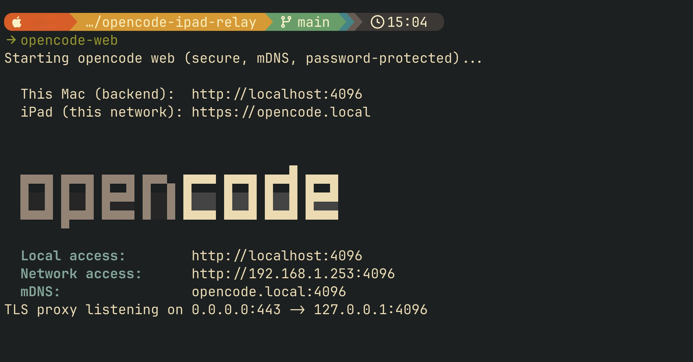
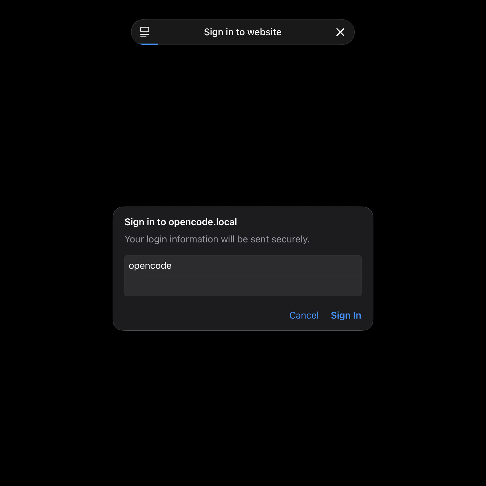
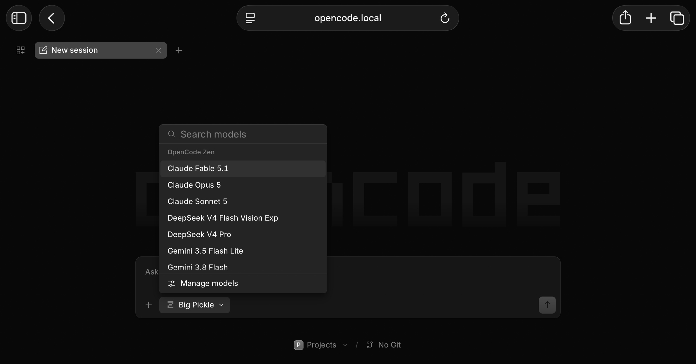

# opencode-ipad-relay

[](https://github.com/jk-esc/opencode-ipad-relay/actions/workflows/ci.yml)
[](https://github.com/jk-esc/opencode-ipad-relay/actions/workflows/security.yml)
[](LICENSE)

Secure, encrypted access to [`opencode web`](https://opencode.ai) from an iPad on
the same network — **HTTPS + mDNS + password, with zero third-party software**.
Only stock macOS tools (`python3`, `openssl`) are used.

## Why this project exists

`opencode web` serves a great mobile UI, but it speaks **plain HTTP only** — it
has no native TLS option. That has two nasty consequences on a shared network
(university, airport, coffee shop, coworking Wi-Fi):

- **Your password is sniffable.** `opencode web` supports HTTP Basic Auth, but
  over plain HTTP the credentials travel as cleartext base64. Anyone capturing
  traffic on the same LAN can read them.
- **mDNS is convenient but unencrypted.** Running `opencode web --mdns` gives
  you a nice stable name (`opencode.local`), but the traffic itself is still
  exposed.

The usual workarounds each have an unacceptable cost for this use case:

| Alternative                             | Problem                                                      |
| --------------------------------------- | ------------------------------------------------------------ |
| Tailscale / VPN mesh                    | Requires installing an extra app on both devices             |
| ngrok / Cloudflare Tunnel               | Exposes a **public** URL to the internet                     |
| SSH tunnel                              | The iPad needs a third-party SSH client to browse through it |
| Commercial reverse proxy (nginx, Caddy) | Yet another thing to install                                 |

This project closes the gap with **nothing but what macOS already ships**: a
tiny stdlib-only Python TLS relay in front of `opencode web`, a self-signed
certificate you trust once on the iPad, and mDNS for discovery. The result is
real HTTPS, LAN-only, password-protected, no installs.

## Screenshots





## Architecture

```
┌─────────────┐   HTTPS (TLS)    ┌──────────────────────┐   HTTP   ┌─────────────────────┐
│    iPad     │ ───────────────► │ Python TLS relay      │ ───────► │ opencode web        │
│  (trusts    │   https://       │ 0.0.0.0:443           │  127.0.0 │ 127.0.0.1:4096      │
│  cert once) │   opencode.local │ (self-signed cert)    │   1:4096 │ (bound to localhost)│
└─────────────┘                  └──────────────────────┘          └─────────────────────┘
        ▲                                ▲                                   ▲
        │  only reachable on the         │  single LAN-facing listener       │  not exposed to the
        │  same network (mDNS)           │  (terminates TLS)                  │  network at all
```

The relay is a **raw TCP byte-pump**, not an HTTP proxy: the opencode web UI
depends on long-lived streams (Server-Sent Events on `/event`, WebSocket-style
sessions, keep-alive). An HTTP-level proxy strips the headers those need and
blocks on streams that never end — the page loads but the UI is dead. A
byte-level relay passes everything through untouched while still terminating
TLS, so the iPad<->Mac hop is fully encrypted.

## Requirements

- **Any Mac** — MacBook, iMac, Mac mini, Mac Studio — running a recent macOS.
  CI tests on macOS 15, both Intel and Apple Silicon.
- [`opencode`](https://opencode.ai) installed on that Mac (e.g. `brew install
  opencode`). The relay itself adds nothing beyond what macOS ships.
- `python3` and `openssl` — stock on macOS. On a brand-new Mac, running
  `python3` for the first time may show an Apple dialog offering to install
  the Command Line Tools; accept it once and you're set.
- An iPad on the **same local network**.
- No third-party apps on the iPad, no tunnels, no accounts, no public exposure.

## Quickstart

```bash
git clone https://github.com/jk-esc/opencode-ipad-relay.git
cd opencode-ipad-relay
./install.sh
```

The installer will:

1. Verify the prerequisites.
2. Prompt you to choose a password (stored only on your Mac, mode `600`).
3. Generate a 10-year self-signed certificate for `opencode.local` (with your
   current LAN IP as a SAN backup).
4. Install `opencode-web` and `opencode-web-proxy.py` into `~/.local/bin`.
5. Print the one-time iPad trust steps.

Then, one time on the iPad: AirDrop `~/.local/share/opencode-web/cert.pem` to
it, install the profile, and enable full trust under
**Settings → General → About → Certificate Trust Settings**.

## Daily use

```bash
opencode-web
```

On the iPad (same network): `https://opencode.local` — log in with username
`opencode` and the password you chose.

The Mac's IP can change between networks; mDNS keeps `opencode.local` pointing
at it. `caffeinate -i` in the launcher keeps the Mac awake (AC or battery)
while the server runs.

## Security highlights

- ✅ **Real TLS 1.3** between iPad and Mac — nothing is sniffable on shared Wi-Fi
- ✅ **Password travels inside TLS**, never as cleartext on the wire
- ✅ **LAN-only** — nothing is exposed to the internet, nothing to port-forward
- ✅ **Backend never touches the network** — `opencode web` stays bound to
  `127.0.0.1`; the relay is the only LAN-facing listener
- ✅ **Works with Safari's HTTPS-Only Mode fully enabled.** Because this is
  genuine HTTPS with a certificate your iPad trusts, you never need to weaken
  your browser's defenses — no "allow insecure content", no exceptions, no
  downgrades. Security is reinforced, not relaxed.
- ✅ **No third-party code** — stdlib Python + openssl, already on your Mac

## Honest limits

- **Same network only.** mDNS does not resolve across networks; this setup is
  intentionally LAN-only and does not cover remote access.
- **Self-signed trust.** The certificate isn't CA-issued; trust comes from you
  installing it on your own device. Encryption strength is unaffected.
- **Not device allow-listing.** Any device on the LAN with both your cert and
  your password could connect. In practice, only your iPad has both.
- **No brute-force protection.** A determined attacker on your LAN could hammer
  the login. Choose a strong password.

## Troubleshooting

Most issues are one of: the iPad cert profile isn't installed/trusted, the iPad
and Mac aren't on the same network, or a stale relay process is squatting on
port 443 (`pkill -f opencode-web-proxy.py`).

## Uninstall

```bash
./uninstall.sh
```

Removes the installed scripts and (optionally) the certificate and password.
Remember to also delete the profile on the iPad.

## Contributing

Contributions are welcome. Before opening a pull request, run the full local
gate (the same checks CI runs):

```bash
# one-time: dev tooling (not needed to *use* the project)
python3 -m venv .venv && .venv/bin/pip install -r requirements-dev.txt
brew install shellcheck shfmt bats-core gitleaks actionlint

./scripts/check.sh
```

This runs shellcheck, shfmt, ruff, mypy, bandit, the pytest suite (relay),
the bats suite (installer), and gitleaks. CI additionally runs the tests on
both Intel and Apple Silicon macOS runners and CodeQL on Python.

Please keep these invariants:

- **No secrets in the repo** — passwords/certs/keys are generated locally.
- **The relay stays a raw TCP pump** — no HTTP parsing.
- **Python stays stdlib-only** for anything shipped to users (dev tooling excepted).

## License

[MIT](LICENSE)
